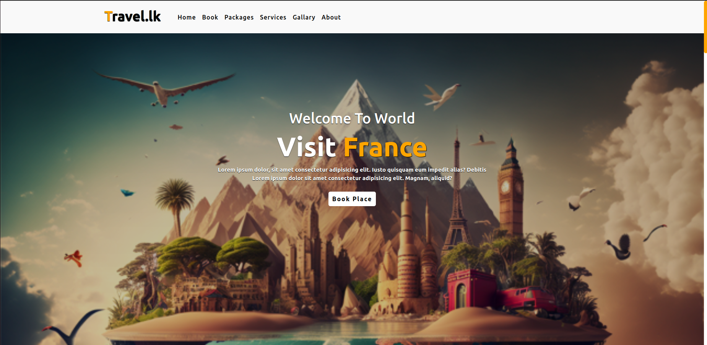
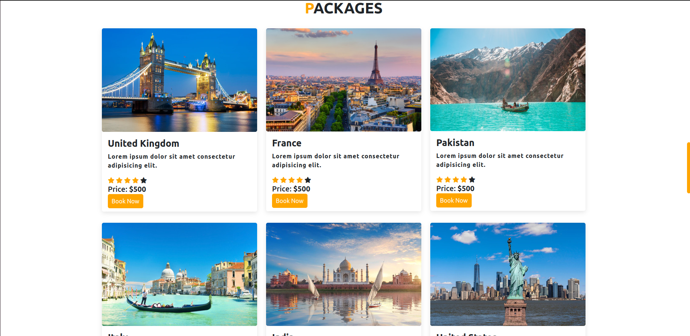
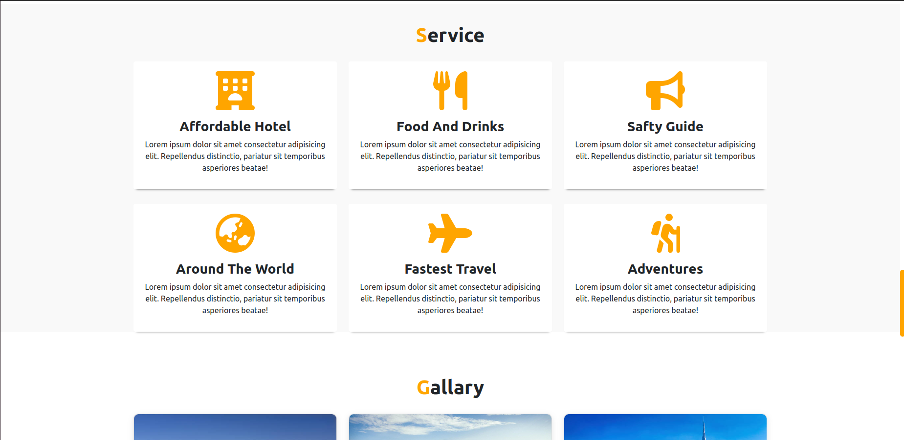
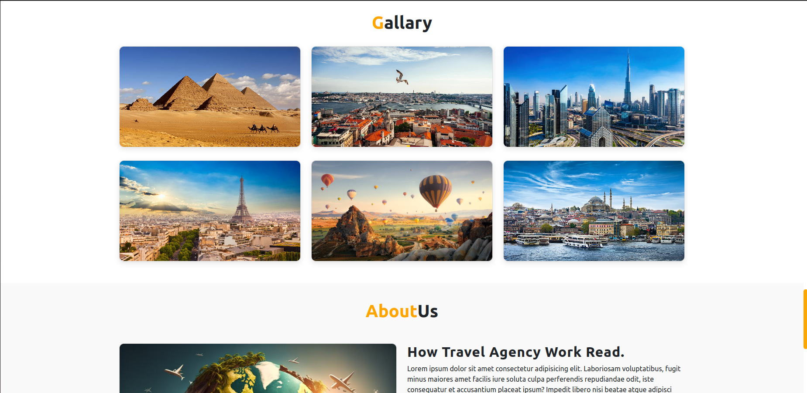
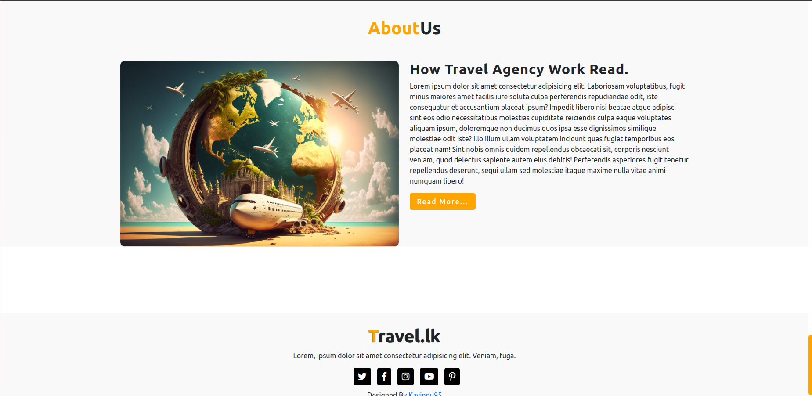

# Travel.lk Website

This is a Travel Website project that allows users to explore and book travel destinations. It provides information about various travel packages, services, and a gallery of beautiful destinations.

## Features

- **Home:** Discover stunning destinations and explore travel options.
- **Book:** Easily book your dream vacation with a simple form.
- **Packages:** View and book travel packages to different countries.
- **Services:** Find information about affordable hotels, food and drinks, safety guides, and more.
- **Gallery:** Explore a gallery of captivating images from various destinations.
- **About Us:** Learn more about how our travel agency works and our mission.

## Screenshots

Insert screenshots of your project to give users a visual preview.

## Technologies Used

- HTML
- CSS
- Bootstrap
- JavaScript

## Installation

1. Clone the repository: https://kavindu95.github.io/Travel-Tour-Website-Using-HTML-CSS-BOOTSTRAP-5/
2. Open the project in your code editor.

## Usage

Describe how to use your project and provide any necessary instructions.

## Contributing

If you'd like to contribute to this project, please follow these guidelines.

## License

This project is licensed under the [MIT License](LICENSE).

## Contact

- Your Name - [Kavindu95](https://github.com/Kavindu95)
- Email: kavindueng95@gmail.com
- Project Link: [GitHub](https://kavindu95.github.io/Travel-Tour-Website-Using-HTML-CSS-BOOTSTRAP-5/)
